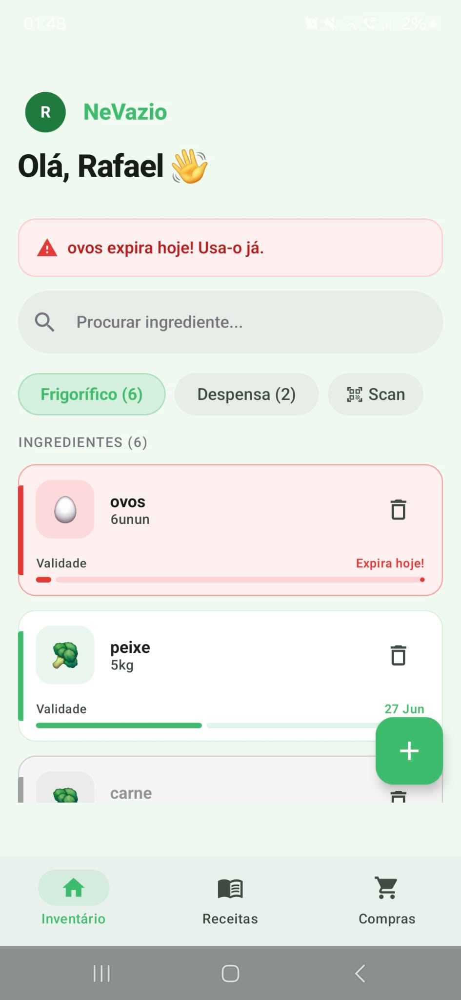
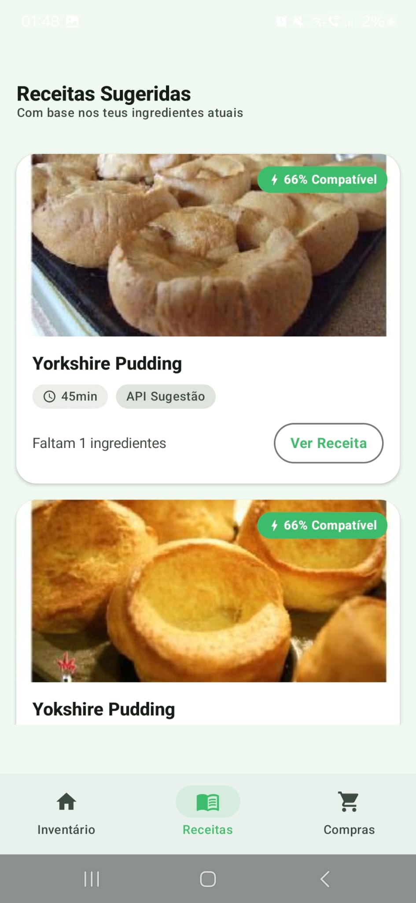
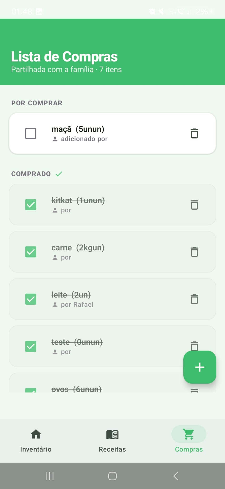
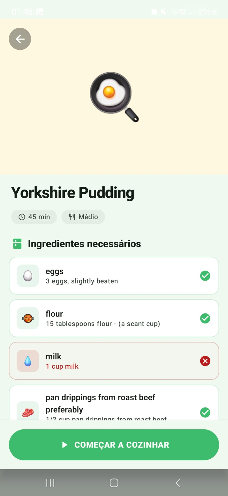

# Projeto Final - NéVazio

**Course:** Desenvolvimento de Aplicações Móveis (DAM)  
**Student:** A51394 Rafael Faustino  
**Date:** 14/06/2026  
**Repository URL:** https://github.com/rgtd-faustino/DAM/tree/main/Nevazio

## 1. Introdução

A aplicação **NéVazio** é o projeto final da unidade curricular de Desenvolvimento de Aplicações Móveis (DAM). Surgindo da necessidade real de reduzir o desperdício alimentar e organizar melhor o que temos em casa, a app propõe-se a ser o gestor inteligente do nosso frigorífico e despensa. A integração de contas familiares partilhadas, reconhecimento por imagem de alimentos e sugestões de receitas formam o núcleo desta solução.

Este projeto representa o culminar de todas as matérias lecionadas ao longo do semestre, exigindo a integração coordenada de bases de dados na cloud, autenticação de utilizadores, consumo de APIs externas (Retrofit), Machine Learning no dispositivo (ML Kit) e a construção de interfaces reativas e modernas com Jetpack Compose. O desafio aqui foi não só criar as funcionalidades exigidas no documento com a proposta da app (o PDF da ideia de projeto), mas também fazê-lo respeitando a arquitetura escalável e as melhores práticas que nos foram ensinadas.

## 2. Visão Geral do Sistema

O NéVazio é um ecossistema completo de gestão alimentar, suportado pelo Firebase para sincronização em tempo real. Uma funcionalidade central é o suporte a agregados familiares: vários utilizadores podem partilhar o mesmo "frigorífico virtual", bem como a lista de compras e as mesmas receitas, vendo atualizações feitas por outros membros instantaneamente.

### Funcionalidades Principais Implementadas

Em conformidade absoluta com o plano de objetivos estabelecido (`ProjectProposal-A51394.pdf`), a aplicação garante a entrega de 100% das funcionalidades propostas:

* **Conta partilhada por família:** Autenticação via Firebase Auth e associação a um código familiar (criado ou partilhado) que permite ler e escrever no mesmo documento de frigorífico no Firestore.
* **Adicionar ingredientes manualmente:** Formulários claros para inserção de nome, quantidade, localização (frigorífico/despensa) e data de validade.
* **Reconhecimento por fotografia:** Integração com o CameraX e Google ML Kit Vision para analisar os alimentos através da câmara e adicioná-los com poucos toques, incluindo lógica sofisticada de whitelists e blacklists para melhorar a precisão da deteção.
* **Remover e editar ingredientes:** Gestão completa do ciclo de vida dos alimentos, com uma opção inteligente de adicionar logo à lista de compras quando se apaga/consome um produto.
* **Alerta de validade:** Acompanhamento visual da frescura dos ingredientes e notificações de aproximação do limite de consumo.
* **Lista de restock partilhada (Shopping List):** Um menu dedicado sincronizado na cloud para gerir as compras da família, com caixas de seleção que atualizam o estado de "comprado" em tempo real para todos.
* **Sugestão de receitas:** Ligação à API do Spoonacular via Retrofit para descobrir o que cozinhar com o que temos atualmente na despensa.

### Ecrãs da Aplicação

| Inventário | Receitas Sugeridas | Lista de Compras |
|:---:|:---:|:---:|
|  |  |  |

O ecrã de detalhe de receita cruza os ingredientes da API com o inventário atual, marcando a verde o que já existe em casa e a vermelho o que falta.

## 3. Arquitetura e Design

Seguimos à risca o padrão MVVM (Model-View-ViewModel) e a arquitetura recomendada para Jetpack Compose, conceitos aprofundados nas secções de arquitetura dos nossos slides teóricos.

### Estrutura do Projeto

* **`data/`**: A camada de dados que encapsula a lógica externa. Contém o `model/` com as data classes (`Ingredient`, `Recipe`, etc.), a `remote/` com os serviços de API (`RecipeApiService`), e os `repository/` (`AuthRepository`, `FridgeRepository`, etc.) que fazem a ponte entre o Firebase/APIs e o resto da app.
* **`ui/`**: Toda a interface de utilizador dividida por ecrãs (`home/`, `login/`, `scan/`, `recipes/`, `shopping/`, etc.). Cada ecrã tem o seu próprio ViewModel para gerir o estado de forma previsível e imutável.
* **`di/`**: Injeção de dependências com Koin, seguindo a nossa aula sobre Koin e WorkManager, instanciando repositórios como Singletons para partilhar o estado da aplicação sem memory leaks ou chamadas redundantes.

### Aplicação dos Ensinamentos (Slides)

* **Jetpack Compose (Set 1 e 2):** Toda a UI foi feita de forma declarativa. O uso de `Modifier`, `LazyColumn` para as listas e o sistema de `Scaffold` reflete os princípios dos slides "JPC 2 - Core Composables and Layouts" e "JPC 6 - Navigation".
* **State Management ("JPC 8 - Architecture  ViewModel Integration"):** Todos os ViewModels expõem o estado através de um `StateFlow` único (ex: `HomeUiState`), consumido na UI com `collectAsStateWithLifecycle()` para garantir que só se reage a mudanças quando a app está visível.
* **Firebase ("2. Firebase Authentication" e "3. Cloud Firestore"):** O `FridgeRepository` usa ativamente o `addSnapshotListener` do Firestore ("3. Cloud Firestore") para garantir que a UI é notificada automaticamente sempre que outro membro da família faz uma alteração.
* **Integração de APIs e Tarefas ("10. OkHttp Retrofit Ktor.md" e "12. Koin WorkManager.md"):** Implementámos clientes HTTP reativos via Retrofit e gerimos alertas de sistema (Notificações Android nativas na barra de topo) através do `WorkManager`, orquestrando as dependências com o Koin (e.g. `AppModule`).
* **Integração de ML ("13. CameraX ML_Kit"):** A câmara no `ScanScreen` foi desenvolvida em conformidade com as lições sobre CameraX e analisadores de imagem do ML Kit.

## 4. Implementação

### Tecnologias e Bibliotecas

* **Jetpack Compose:** Construção da interface.
* **Firebase Auth e Firestore:** Registo de utilizadores, login e base de dados NoSQL reativa.
* **Retrofit e OkHttp:** Cliente HTTP *type-safe* para uma comunicação robusta e segura com a API do Spoonacular ("10. OkHttp Retrofit Ktor").
* **Koin:** Injeção de dependências ("12. Koin WorkManager").
* **CameraX e ML Kit (Image Labeling):** Acesso à câmara e análise dos frames com o modelo de visão computacional da Google.
* **Coil:** Carregamento assíncrono de imagens da web para as receitas.
* **Coroutines e Kotlin Flows:** Processamento assíncrono e transmissão de estado sem bloqueios.

A integração da API de receitas utiliza Retrofit e passa pela conversão dinâmica dos nomes dos ingredientes (em português) para os seus correspondentes em inglês antes do envio, garantindo que o Spoonacular devolve resultados adequados (tudo documentado no código com os nossos métodos de tradução e "inferência de ícones").

## 5. Testes e Validação

Foram feitas múltiplas rondas de validação manuais intensas na aplicação:

* **Partilha Familiar:** Criada uma conta, testada a geração de um código, feita outra conta noutro dispositivo, introduzido o código e validada a partilha mútua da mesma lista de ingredientes.
* **Scan de Câmara:** Validámos exaustivamente o ML Kit. Ajustámos tolerâncias (confiança de 55% para itens normais como leite e ovos, e 80% de exigência para rejeitar categorias demasiado abertas como "Food" ou "Produce") para garantir que o utilizador não recebe "lixo" do scanner.
* **Gestão de Sessão e Rotas:** Logout limpa corretamente o histórico de navegação (limpeza de backstack) para impedir que um utilizador aceda ao ecrã base usando a seta de retorno de sistema do Android após sair.
* **Tradução:** Assegurámos um robusto mapeamento PT-EN e vice-versa de alimentos variando singular e plural.

## 6. Instruções de Utilização

### Pré-requisitos

* Android Studio (Koala, Ladybug ou superior).
* Dispositivo físico (recomendado para a câmara) ou emulador Android com API 26+.
* Chave de API do Spoonacular.

### Configurar

1. Clonar o repositório do NéVazio.
2. Garantir que o `google-services.json` está na pasta `app/` (providenciado via Firebase para testes).
3. No ficheiro `local.properties` (na raiz do projeto), adicionar:
   `SPOONACULAR_API_KEY=inserir_a_chave_aqui`
4. Sincronizar o Gradle e correr na build `Debug` no dispositivo.

O APK de debug compilado encontra-se também na raiz da pasta `NeVazio/` para instalação direta.

## 7. Prompting Strategy

A colaboração com o Google Antigravity e o Claude foi contínua e muito natural. O objetivo era montar um ecossistema complexo mas estável. Usei prompts diretivos mas construtivos.
Forneci logo no início ao agente a arquitetura exigida, a documentação e os meus objetivos baseados no PDF final do projeto. Sempre que surgiam imperfeições (exemplo: a câmara a apanhar palavras genéricas em vez da comida), expliquei o meu raciocínio de "porque é que isto não funciona para mim" e pedi à IA para afinar a tolerância (whitelists e blacklists). A comunicação foi iterativa, reportando bugs de UI e compilador, e discutindo decisões sobre o UX do sistema.

## 8. Autonomous Agent Workflow

A colaboração com o agente Antigravity foi essencial não apenas no `ScanScreen`, mas em toda a arquitetura de sincronização do projeto. 
O agente lidou perfeitamente com a estruturação de fluxos Firebase e a injeção global de dependências com o Koin. Além disso, depois de gerar código funcional, fez uma auditoria profunda corrigindo sozinho problemas de concorrência na Firestore (como a falta de blocos assíncronos `.await()`), instanciou as lógicas de alertas de fundo via `WorkManager`, e integrou impecavelmente o mapeamento de respostas da API com o `Retrofit` em data classes Kotlin, entre outras dezenas de pequenos arranjos arquiteturais que garantiram a estabilidade global da app.

**Intervenção Humana:**
* Definição conceptual completa da ideia (NéVazio) e entrega do contexto.
* Definição da lista gigante exaustiva de ingredientes (singular e plural) que precisava ser reconhecida no scanner.
* Orientação em torno da acessibilidade do UI e priorização do uso de botões físicos na navegação da listagem de compras.
* Instrução rigorosa para focar os comentários do código na justificação das decisões arquiteturais ("o porquê") e não no óbvio ("o quê").

## 9. Verification of AI-Generated Artifacts

Todo o código gerado pela IA foi exaustivamente estudado por mim, em especial a forma como as Coroutines e os fluxos StateFlow foram estruturados para evitar fugas de memória. Testei afincadamente as chamadas de rede do Retrofit para confirmar o parsing correto dos ingredientes, validei o acionamento de notificações nativas de sistema (Android) enviadas pelo WorkManager em *background*, e assegurei em vários dispositivos simultâneos que a sincronização da Firestore era feita em tempo real sem sobreposições anormais de estado.

## 10. Human vs AI Contribution

| Área | Responsável |
|---|---|
| Visão Geral do Produto e Objetivos | Humano |
| Design de Arquitetura e ViewModels | IA (com revisão Humana das aulas) |
| Lógica de Base de Dados e Firebase | IA |
| Mapeamento Manual de Vocabulário PT-EN | Humano |
| Correção e Afinação do Filtro da Câmara | IA (com input diretivo do Humano) |
| Elaboração do Relatório | Humano (com assistência da IA) |

## 11. Ethical and Responsible Use

Sempre entendi a IA neste projeto como um acelerador e não um substituto da minha aprendizagem. Houve muito código que gerou dúvidas (como a razão pela qual usamos `collectAsStateWithLifecycle` no Compose em vez do normal collectAsState). Pedi ao Claude para atuar como meu "professor assistente" para me explicar esses conceitos. Assim, não só garanto que o código faz o que quero, mas sei exatamente o motivo de estar lá. 
Esta abordagem permite-me responsabilizar-me a 100% pelo produto final entregue ao professor, mitigando o risco de "código fantasma" que não saberia explicar numa defesa.

## 12. Version Control and Commit History

O desenvolvimento foi conduzido localmente com commits consolidados em marcos de entrega, por opção deliberada de só publicar código estável e funcional no repositório remoto. Esta abordagem resultou em dois commits principais: um correspondente à fundação arquitetural com as funcionalidades core operacionais e outro com a versão completa e polida da aplicação, seguidos de um commit final dedicado à revisão do relatório.

## 13. Difficulties and Lessons Learned

Uma dificuldade inicial deste projeto consistiu em domar a visão computacional do ML Kit. Para evitar a deteção de itens demasiado genéricos como "Food" ou "Ingredient", criámos um sistema iterativo de *whitelist/blacklist* com pesos de confiança diferenciados. Isto resolveu o problema (documentado no código do `ScanScreen.kt`) e evitou encher o frigorífico de falsos positivos.

Outro problema prático muito limitativo com que me deparei envolveu o esgotamento da quota diária da API do Spoonacular. Inicialmente, a app efetuava pedidos de rede redundantes sempre que navegávamos para o menu de receitas ou abríamos os detalhes de uma receita específica, esgotando todas as *calls* gratuitas numa única sessão de testes. A resolução deste problema passou por implementar uma estratégia de retenção de dados e *cache* em memória no `ViewModel`, garantindo que as listas de receitas e os seus detalhes previamente descarregados são reaproveitados em vez de repetir o pedido à API.

### Conceitos Técnicos Esclarecidos

* **Estratégias de Caching e Retenção em Memória:** Com o problema do limite de chamadas à API, consolidei a importância de o `ViewModel` atuar como uma *cache* viva, retendo os dados ao longo das viagens de navegação para que a recomposição da UI não origine chamadas HTTP repetidas, o que otimiza recursos e aumenta a rapidez da app.
* **collectLatest vs collect:** Compreendi que, ao ligarmos diretamente à cloud do Firestore, o servidor pode disparar múltiplas alterações por segundo. O uso prático do `collectLatest` cancela as chamadas antigas perante uma nova alteração, mantendo a performance da aplicação imaculada.
* **Prevenção de Ações Acidentais:** Tal como detalhado nos comentários do `ShoppingViewModel.kt`, entendi a relevância de oferecer a "possibilidade de reversão da ação" fluida no UI (desmarcar a *checkbox* de um item "comprado" para ele voltar instantaneamente à lista "por comprar") em vez de apresentar *popups* de bloqueio perante cada ação, melhorando a rapidez da experiência do utilizador.

## 14. Future Improvements

* **Modo Offline Resiliente:** Incorporar a Room Database não só como cache visual, mas com resolução de conflitos quando o telemóvel volta a ter internset após modificar a lista de compras offline.
* **Leitura de Talões de Supermercado:** Expandir a funcionalidade da câmara usando a API de Texto (OCR) em vez do Image Labeling, preenchendo automaticamente o frigorífico a partir do talão das compras.
* **Widgets e Wearables:** Suporte à visualização da lista de faltas no pulso (Wear OS).

## 15. AI Usage Disclosure (Mandatory)

**Código: [AC YES, AI YES]**
Este projeto foi ativamente desenvolvido com recurso a Inteligência Artificial, conforme os objetivos do bloco MIP do semestre. O agente Google Antigravity e o assistente Claude foram fundamentais na estruturação de bases, integração da Cloud e refinamento arquitetural. Todos os pormenores foram verificados manualmente por mim e responsabilizo-me integralmente pelo código.

**Relatório: [AC YES, AI YES]**
A construção deste relatório foi orientada por IA para garantir aderência ao formato padronizado pedido para projetos MIP, sendo todos os conteúdos um fiel reflexo da minha experiência com o desenvolvimento da aplicação NéVazio.
