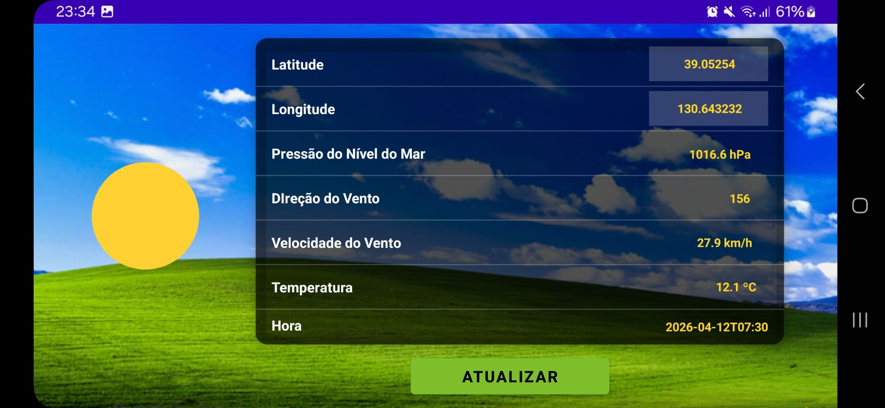
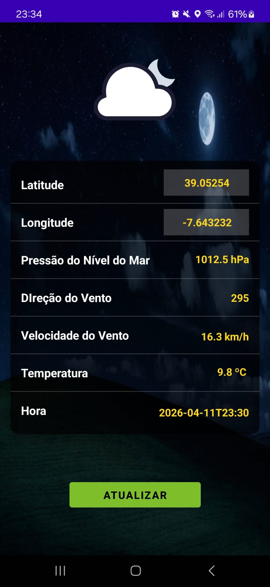
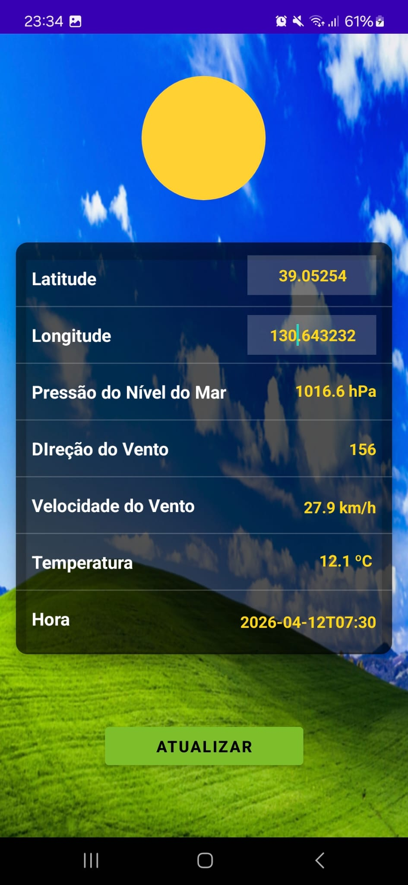

# Assignment 3 — My Cat Gallery App

**Course:** Desenvolvimento de Aplicações Móveis (DAM)  
**Student:** A51394 Rafael Faustino  
**Date:** 12/04/2026  
**Repository URL:** [DAM_TP2_MIP](https://github.com/rgtd-faustino/DAM/edit/main/TP2/repo3/)

---

## High-Level Project Description

A **My Cat Gallery App** é uma aplicação móvel para Android desenvolvida no âmbito da unidade curricular de DAM. A aplicação serve como uma montra digital e informativa de felinos, combinando a exploração visual de imagens aleatórias com a consulta de dados técnicos e biológicos sobre diferentes raças de gatos. O projeto foca-se na robustez técnica, utilizando carregamento assíncrono de dados, persistência local e uma arquitetura que garante a operacionalidade mesmo em condições de rede instáveis.

### Application Purpose

O objetivo principal desta aplicação é demonstrar a integração de múltiplos serviços e bibliotecas num ecossistema Android moderno. A aplicação permite aos utilizadores:
*   Descobrir novas imagens de gatos de forma dinâmica.
*   Guardar os seus gatos favoritos num sistema de gestão persistente (FIFO).
*   Aceder a informações detalhadas (raça, origem, temperamento) que transformam uma simples galeria numa ferramenta educativa.
*   Garantir o acesso aos dados previamente visualizados através de um sistema de cache inteligente.

### API Used

A aplicação consome a **[TheCatAPI](https://thecatapi.com/)**, uma API REST pública e poderosa que fornece:
*   Milhares de imagens de gatos em alta resolução.
*   Metadados detalhados sobre centenas de raças reconhecidas internacionalmente.
*   Endpoints específicos para consulta de detalhes de imagens e raças individuais.

A autenticação é gerida de forma segura através de uma chave de API injetada via `x-api-key` header em cada pedido.

---

## Screenshots

| Landscape | Night Portrait | Day Portrait |
|:---:|:---:|:---:|
|  |  |  |
---

## 1. Introdução

Este relatório descreve o desenvolvimento da "My Cat Gallery App", uma aplicação Android que permite explorar o vasto catálogo da TheCatAPI. O projeto representa a evolução final do primeiro conjunto de trabalhos práticos de DAM, focando-se na integração de APIs REST, persistência local de dados, e na aplicação de padrões de arquitetura modernos (MVVM) com bibliotecas consagradas como Retrofit e Glide.

A aplicação foi desenhada para oferecer uma experiência de utilizador fluida, permitindo não só visualizar imagens aleatórias de gatos, mas também gerir uma lista de favoritos com persistência offline e consultar informações detalhadas sobre as raças de cada felino.

---

## 2. Visão Geral do Sistema

A aplicação está organizada em torno de três eixos principais, acessíveis através de uma barra de navegação inferior (`BottomNavigationView`):

- **Galeria (`GalleryFragment`)**: Apresenta uma grelha de imagens aleatórias obtidas em tempo real. Inclui um botão de atualização que recarrega os dados e realiza scroll automático para o topo da lista.
- **Favoritos (`FavoritesFragment`)**: Exibe as imagens marcadas pelo utilizador. Utiliza uma lógica **FIFO (First-In, First-Out)**, permitindo no máximo 5 favoritos; ao adicionar o sexto, o mais antigo é removido automaticamente.
- **Ecrã de Detalhes (`ImageDetailActivity`)**: Oferece uma vista detalhada da imagem, incluindo metadados técnicos (ID, dimensões em pixels) e uma "enciclopédia" sobre a raça, caso disponível (origem, temperamento, descrição e esperança de vida).

A aplicação inclui suporte para **modo offline**, servindo imagens a partir de uma cache local de 50 itens quando a ligação à internet falha.

---

## 3. Arquitetura e Design

### Padrão MVVM (Model-View-ViewModel)

A arquitetura foi estruturada para separar claramente a lógica de negócio da interface:
- **`model`**: Classes de dados (`CatImage`, `Breed`) anotadas para desserialização JSON.
- **`viewmodel`**: Gere o estado da UI e a comunicação com o repositório, expondo dados via `LiveData`.
- **`repository`**: Única fonte de verdade para os dados, gerindo a alternância entre a API e a cache local.

### Gestão de Dados e Persistência

- **`FavoritesManager`**: Encapsula a lógica da fila FIFO. Os dados são persistidos em `SharedPreferences` em formato JSON através da biblioteca Gson. Esta escolha foi feita pela simplicidade e rapidez de implementação para uma lista pequena (5 itens).
- **`CacheManager`**: Gere uma cache circular de 50 imagens para garantir que a aplicação apresenta conteúdo mesmo sem rede.
- **`CatApiService`**: Interface Retrofit configurada para injetar a chave de API nos headers de cada pedido.

### Decisões de UI/UX

- **Paleta de Cor e Tema**: Utilizou-se o Material Design 3 com cores Indigo e Amber, conferindo um aspeto moderno e profissional.
- **Feedback Visual**: O botão de favoritos no ecrã de detalhes alterna dinamicamente entre "Adicionar" (Azul) e "Remover" (Vermelho), informando o utilizador sobre o estado atual do item.
- **Scroll Automático**: Pequena melhoria de UX que garante que o utilizador vê sempre o novo conteúdo após uma atualização da galeria.

---

## 4. Implementação

### Integração com TheCatAPI

Para resolver o problema das dimensões em falta nos resultados da pesquisa geral, implementou-se uma chamada dedicada ao abrir o ecrã de detalhes:
```kotlin
// CatApiService.kt
@GET("v1/images/{image_id}")
suspend fun fetchCatImageDetail(@Path("image_id") id: String): CatImage
```
Isto permite obter o objeto completo com `width` e `height` reais, garantindo precisão na informação apresentada ao utilizador.

### Estrutura de Fragmentos

A `MainActivity` atua como contentor, trocando entre `GalleryFragment` e `FavoritesFragment` conforme a seleção na `BottomNavigationView`. Esta abordagem é mais eficiente em termos de memória do que usar múltiplas Activities para ecrãs principais.

---

## 5. Testes e Validação

Foram realizados testes manuais exaustivos cobrindo os seguintes cenários:

- **Lógica FIFO**: Verificação de que ao adicionar o 6º favorito, o 1º desaparece do histórico e da persistência.
- **Modo Offline**: Simulação de perda de ligação (Modo Avião) e verificação de que a aplicação carrega imagens da cache local com aviso de erro apropriado.
- **Rotação de Ecrã**: O uso de ViewModels garante que os dados da galeria não são perdidos ao rodar o dispositivo.
- **Formatação de Dados**: Validação da exibição de metadados de raças complexas e fallback para "Raça desconhecida" quando a API não fornece informação.

---

## 6. Instruções de Utilização

### Pré-requisitos

- Android Studio (Hedgehog ou superior)
- SDK Android API 24 (Nougat) ou superior
- Uma chave de API da [TheCatAPI](https://thecatapi.com/signup)

### Configuração

1. Clonar o repositório.
2. No ficheiro `local.properties` (raiz do projeto), adicionar a linha:
   `CAT_API_KEY=a tua_chave_aqui`
3. Sincronizar o projeto com o Gradle.

### Execução

Compilar e correr no emulador ou dispositivo físico através do botão **Run** no Android Studio. Caso prefira a linha de comandos:
```bash
./gradlew installDebug
```

---

# Autonomous Software Engineering Sections

## 7. Prompting Strategy

O desenvolvimento utilizou o agente de IA Antigravity (Google) em colaboração com o aluno. A estratégia de prompting seguiu uma estrutura rigorosa baseada no plano de implementação predefinido:

| Componente | Descrição |
|---|---|
| Context | Contexto de desenvolvimento Android (Tutorial 2) e integração de APIs REST |
| Goal | Criar uma galeria funcional com suporte a favoritos, cache offline e metadados de raças |
| Constraints | MVVM, Retrofit, Glide, SharedPreferences/Gson, Lógica FIFO, Android API 24+ |
| Plan | Seguimento estrito do `implementation_plan.md` em 15 passos fundamentais |
| Verification | Testes no emulador, validação de tipos de dados e tratamento de exceções de rede |
| Deliverables | Código Kotlin completo, layouts XML, recursos de UI e documentação técnica |

---

## 8. Autonomous Agent Workflow

O agente Antigravity contribuiu ativamente em todas as fases do desenvolvimento, identificando e corrigindo problemas de forma autónoma:

**Planeamento e Implementação:**  
O agente geriu a criação da estrutura de pacotes, implementação do repositório com estratégia de fallback para cache e orquestração dos ViewModels com LiveData.

**Debugging Autónomo:**  
Identificou e corrigiu os seguintes problemas durante o processo:

| Problema | Solução |
|---|---|
| Dimensões 0x0 no ecrã de detalhes | Implementação de endpoint de detalhe individual na API |
| Imagens não carregavam via HTTP | Ativação de `usesCleartextTraffic` e erro de fallback no Glide |
| Conflitos de ambiente com `jlink` | Execução de `clean` e ajuste para JDK 25 |
| Scroll não resetava ao atualizar | Implementação de `smoothScrollToPosition(0)` no observer da galeria |
| Erro de compilação em Fragmentos | Correção manual de sintaxe e importações no `MainActivity` |

**Intervenção Humana:**
- Definição da lógica FIFO e limites de cache (5 e 50 itens respetivamente).
- Escolha da paleta de cores Indigo/Amber para o tema premium.
- Instrução específica para esconder a API key em `local.properties`.
- Pedido de melhoria visual: ícone de remoção de favoritos em cor vermelha.

---

## 9. Verification of AI-Generated Artifacts

O código gerado foi verificado através de:
- **Análise Estática**: Revisão do código para garantir a conformidade com as boas práticas de Kotlin e MVVM.
- **Testes Funcionais**: Validação manual no emulador Pixel 3a (API 37).
- **Simulação de Erros**: Forçar falhas de rede para validar a transição suave para o modo offline e mensagens de erro amigáveis.
- **Persistência**: Reiniciar a aplicação para confirmar que os favoritos FIFO e as configurações de cache se mantêm entre sessões.

---

## 10. Human vs AI Contribution

| Área | Responsável |
|---|---|
| Arquitetura (MVVM), Repositório, Implementação Retrofit/Glide | IA (Antigravity) |
| Lógica FIFO e Gestão de Cache | IA (com parâmetros Humanos) |
| Design de Layouts XML e Temas | Humano (com execução da IA) |
| Configuração de Segurança (BuildConfig/local.properties) | Humano (com execução da IA) |
| Testes e Garantia de Qualidade | Humano |
| Elaboração do Relatório Final | Humano (com assistência da IA) |

---

## 11. Ethical and Responsible Use

O uso de IA neste projeto foi pautado pela transparência e responsabilidade técnica:
- **Risco de Alucinação**: Cada snippet de código gerado foi testado imediatamente no Android Studio para garantir funcionalidade.
- **Propriedade Intelectual**: A IA foi utilizada como um par de programação (Pair Programming), onde as decisões arquiteturais e os requisitos de negócio emanaram do aluno.
- **Segurança**: Garantiu-se que segredos como a API Key nunca seriam expostos ou processados de forma insegura pela IA em ficheiros públicos.

---

# Development Process

## 12. Version Control and Commit History

O histórico de commits reflete uma abordagem incremental por funcionalidade. Iniciou-se com o "core" da aplicação (API/Repository), seguido pela UI baseada em Activities, e finalmente a transição para Fragmentos com Bottom Navigation e polimento visual premium.

---

## 13. Difficulties and Lessons Learned

### Conceitos Técnicos Esclarecidos

- **Lógica FIFO em Persistência**: Aprendeu-se como gerir uma fila circular usando `MutableList` e Gson. A importância de remover o item 0 ao atingir o limite de 5 itens para garantir que o utilizador tem sempre os conteúdos mais recentes.
- **Segurança via local.properties**: Compreendeu-se o fluxo desde a variável local até à sua injeção no `BuildConfig` e posterior uso no `Interceptor` ou headers do Retrofit.
- **K-Anonimato vs Privacidade (Analogia)**: Embora o projeto não utilize hashes complexos como o VaultGuard (exemplo anterior), a prática de enviar apenas o ID da imagem para obter detalhes reflete o princípio de minimização de dados enviados em cada transação API.

### Dificuldades Superadas

- **Ambiente de Compilação**: O erro `Execution failed for task ':app:jlink'` foi um desafio que exigiu a limpeza do diretório `.gradle` e a configuração correta do Java Home, demonstrando que o ambiente Android pode ser sensível a versões de ferramentas de build.
- **Navegação com Fragmentos**: A gestão de fragmentos e a manutenção do estado da UI ao alternar entre separadores exigiu a utilização correta do `FragmentManager` e a preservação de dados nos ViewModels.

---

## 14. Future Improvements

- **Migração para Room**: Substituir SharedPreferences por uma base de dados estruturada para gerir favoritos com mais metadados.
- **Partilha Social**: Implementar o Intent de partilha para enviar imagens de gatos diretamente para outras apps.
- **Filtros Avançados**: Adicionar suporte para filtrar gatos por raça ou categorias (chapéus, caixas, etc.) fornecidas pela API.

---

## 15. AI Usage Disclosure

**Código: [AC YES, AI YES]**  
Este projeto foi desenvolvido com assistência extensiva da IA Antigravity (Google). O aluno orientou o desenvolvimento através de 26 prompts detalhados, revendo cada entrega e corrigindo rumos de implementação. Todo o código foi validado funcionalmente pelo aluno.

**Relatório: [AC YES, AI YES]**  
A redação e estruturação deste relatório foi assistida pelo modelo **Antigravity**. O aluno é totalmente responsável pelo conteúdo apresentado e confirma que o mesmo reflete com rigor o trabalho desenvolvido.
