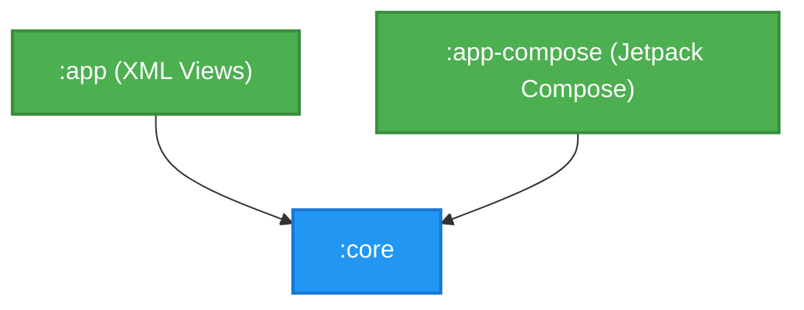

# Diagrama de Dependências entre Módulos

## Descrição dos Módulos

* **`:core`**: Contém a lógica de negócio central da aplicação, modelos de dados, cliente de API (Retrofit), repositório central (`CatRepository`) e gestão local (`CacheManager`, `FavoritesManager`). Não possui dependências de UI específicas de XML ou Compose.
* **`:app`**: Módulo original focado na interface de utilizador utilizando a abordagem clássica do Android com **XML Views**, Activities, Fragments e RecyclerViews. Depende do módulo `:core` para obter e gerir os dados.
* **`:app-compose`**: Novo módulo de interface construído exclusivamente com **Jetpack Compose**. Partilha a mesma lógica de negócio, acedendo diretamente ao `:core`.